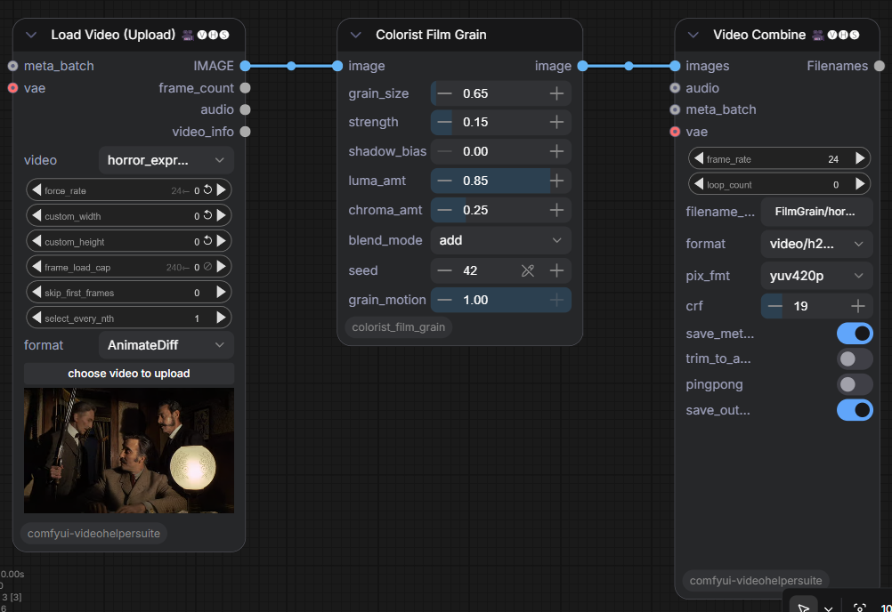
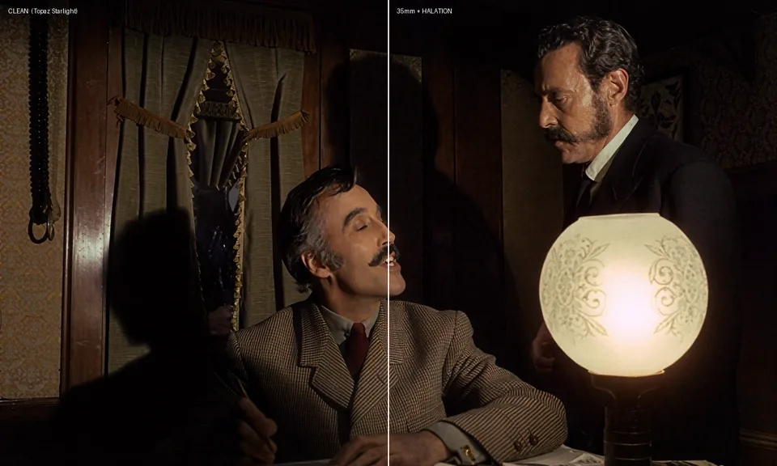
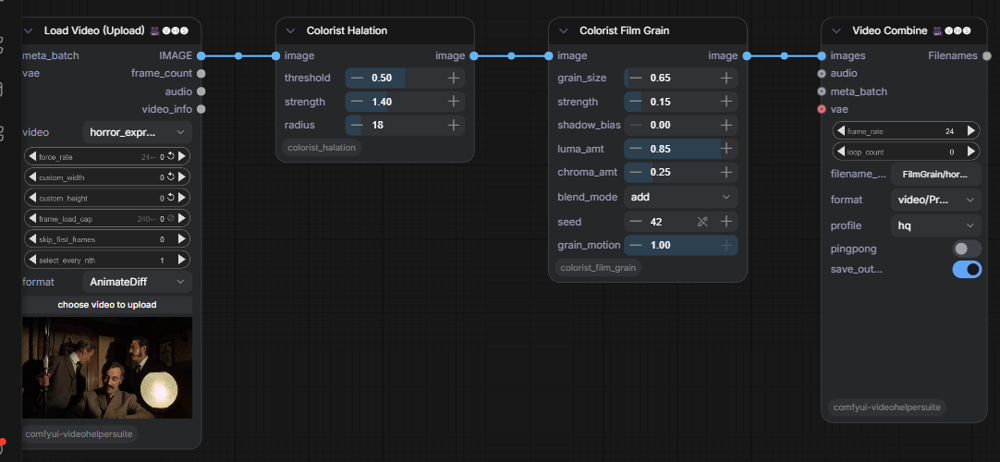

# ComfyUI-ColoristFilmGrain

Colorist film tools for ComfyUI. A 35mm modeled film grain node for video, plus a companion warm-highlight halation node. Built to make AI and digital footage read like film, not like noise.

**Companion pack:** [ComfyUI-DeliveryBay](https://github.com/Atomic-Trash/ComfyUI-DeliveryBay) uses both of these nodes as its optional conformed finish — one master in, a named platform set out, the same grain character at every size.

*Left: clean source. Right: 35mm grain, with halation on the highlight.*

## Why it is different

Most grain tools lay one flat gray layer over the whole frame. Real 35mm grain does not work that way, and this node models what it actually does:

- **Per channel, like three emulsion layers.** Independent grain in R, G and B with the blue layer grainiest and its clumps larger, so it carries the faint color shimmer of real stock instead of flat gray speckle.
- **Crisp band-pass clumps.** Full resolution noise shaped with a difference of Gaussians, so the large-scale blotch is gone and only the fine even sparkle of a real film spectrum remains.
- **Signal dependent amplitude.** Grain peaks in the midtones and is present everywhere, never fully clearing the shadows or highlights. The biggest reason it reads as film instead of added noise.
- **Added, not overlaid.** Signed grain added to the image, the way film density actually fluctuates.
- **Alive, not boiling.** `grain_motion` runs from a frozen plate to fresh every frame (how film behaves), evolving through keyframes with a constant power crossfade so it never pulses.

## Install

1. Clone or copy this folder into `ComfyUI/custom_nodes/`.
2. Restart ComfyUI.
3. Two nodes appear under `image/postprocessing`: **Colorist Film Grain** and **Colorist Halation**.

Torch only. No extra dependencies, nothing to download. For video, pair with [ComfyUI-VideoHelperSuite](https://github.com/Kosinkadink/ComfyUI-VideoHelperSuite) (Load Video / Video Combine).

## Colorist Film Grain

| Control | Range | What it does |
|---|---|---|
| `grain_size` | 0.5 to 4.0 | Clump size. Smaller is fine 35mm, bigger is coarser, older stock (toward 16mm). |
| `strength` | 0 to 1 | Overall grain amount. |
| `shadow_bias` | 0 to 1 | Tonal placement. 0 is the physical midtone peak, higher pushes grain into the shadows. |
| `luma_amt` | 0 to 1 | The achromatic, shared part of the grain. |
| `chroma_amt` | 0 to 1 | The chromatic, per channel part. Set 0 for B&W stock. |
| `blend_mode` | add, overlay, soft_light | add is film true. The others are stylistic. |
| `seed` | integer | Repeatable grain. Same seed, same field. |
| `grain_motion` | 0 to 1 | Temporal life. 0 is frozen, 1 is fresh every frame, the middle is alive but calm. |

## Colorist Halation (companion)

When bright light hits film, some scatters back through the emulsion and base and re-exposes a soft red-orange glow around the highlight. This node does that correctly: in linear light, isolated to the highlights, tinted red-orange, screened back. **Run it before the grain** (halation is image formation, grain sits on top).

| Control | Range | What it does |
|---|---|---|
| `threshold` | 0 to 1 | How bright a pixel must be to bloom. Lower catches more highlights. |
| `strength` | 0 to 4 | How strong the glow is. |
| `radius` | 1 to 128 | How far the glow spreads, in pixels. |

## Example workflows

In `example_workflows/` (UI format, load from ComfyUI's Open / Workflows menu):

- `colorist_film_grain.json` — the three node graph: Load Video, Colorist Film Grain, Video Combine.
- `colorist_film_grain_halation.json` — the four node chain: Load Video, Colorist Halation, Colorist Film Grain, Video Combine.
- `stock_nodes_no_code.json` — a simpler shadow weighted grain built entirely from stock nodes (VideoHelperSuite + ComfyUI post-processing + core), for anyone who wants a no code path.

The Load Video node points at an example filename; repoint it at your own clip.

## Delivering it

Fine grain is the hardest thing for a codec to keep. Master to ProRes or a 10-bit high bitrate file. For h264, use a low crf (around 12) or the encoder smears the grain back into the soft look you started with. Social platforms re-encode on upload, so send the highest quality you can.

## Honest notes

- The three dye layers are modelled as three independent noise channels (blue grainiest); a full model would account for the spectral overlap between layers. The practical version reads right.
- A moving grain field uses a unique plate per frame, which is more memory than a frozen plate. On long or high resolution timelines, render in batches (VideoHelperSuite has a batch manager) or pull `grain_motion` toward frozen.

## Build guide and story

- `docs/Film_Grain_Engine_Build_Guide.pdf` — a two-track build guide (no-code stock path and the one-node version).
- The story behind it is a Field Note: [Film Grain on jeffreykentpost.com](https://jeffreykentpost.com/notes/film-grain).

## How it was built

Built with Claude Code, tested against a live ComfyUI install. That is the working style, and it is part of the point.

## License

MIT. See [LICENSE](LICENSE).
